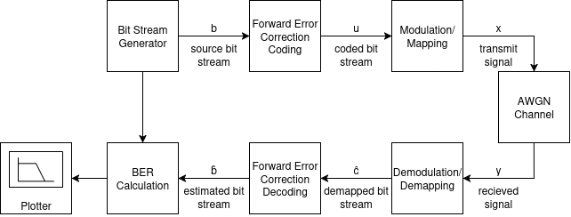

# Free Space Optical Simulation Tool (FROST) 

**Version:** 0.1.0  
**Status:** Development (alpha)  
**Autor:** Robin Graf  
**Lizenz:** --  
**Letztes Update:** Oktober 2025  

*(ehemals: optical-satcom-sim)*

---
## Block Diagram


---

## Überblick

**FROST** ist ein modulares Simulationstool zur Untersuchung und Bewertung digitaler Signalverarbeitungsketten (DSP Chains) für **freie optische Kommunikation (FSO)** und **optische Satellitenlinks**.  
Der Fokus liegt auf Wiederverwendbarkeit, Erweiterbarkeit und wissenschaftlicher Nachvollziehbarkeit.
Die Leistungsbewertung erfolgt über die **Bit Error Rate (BER)** als Funktion von **Eb/N₀**.

---

## Motivation

- Erforschung von *FSO*- und *optischen Satcom-Systemen*  
- Vergleich von *Reed–Solomon*, *LDPC*, *Turbo*- und zukünftigen Codes  
- Simulation typischer *Atmosphäreneffekte* (Turbulenz, Pointing, Extinktion)  
- Experimentelle *DSP-Algorithmen* in TensorFlow für spätere GPU-Integration  

---

## Technologie-Stack

| Bereich | Tools |
|----------|--------|
| Programmiersprache | Python ≥ 3.12 |
| Simulation | TensorFlow, NumPy, Sionna |
| Visualisierung | Matplotlib |
| Codecs | reedsolo, sionna.fec |
| Versionierung | Git + GitHub |
| Doku / CI | Markdown, GitHub Actions (optional) |

---

## Geplante Struktur

```
frost/
├── core/ # Basisklassen (Signals, Blocks, Utilities)
├── modules/ # FEC, Mapper, Channels, etc.
├── examples/ # Beispiel-Skripte
├── tests/ # Unit-Tests
├── .doc/graphics/ # Abbildungen (Blockdiagramme etc.)
├── README.md
└── requirements.txt
```
---

## Beispiel Code

Im Folgenden ist ein beispielhaftes Simulationsskript beschrieben.  
Der Code dient als **Pseudocode** und kann im Laufe der Entwicklung an sich verändernde Anforderungen angepasst werden.  
Jede Funktion gibt ein **TensorFlow-Objekt** zurück, das nach jedem Schritt in der DSP-Kette dieselbe Struktur beibehält.

```python
generator = frost.bitstreamgenerator(parameter)
coder = frost.fec(parameter)
mapper = frost.modulation(parameter)
channel = frost.channelmodel(parameter)
demapper = frost.demodulation(mapper)
decoder = frost.demodulation(coder)

b = generator(parameter)
u = coder(b)
x = mapper(u)
y = channel(x)
c_hat = demapper(y)
b_hat = decoder(c_hat)

ber_plot(b, b_hat)
```
